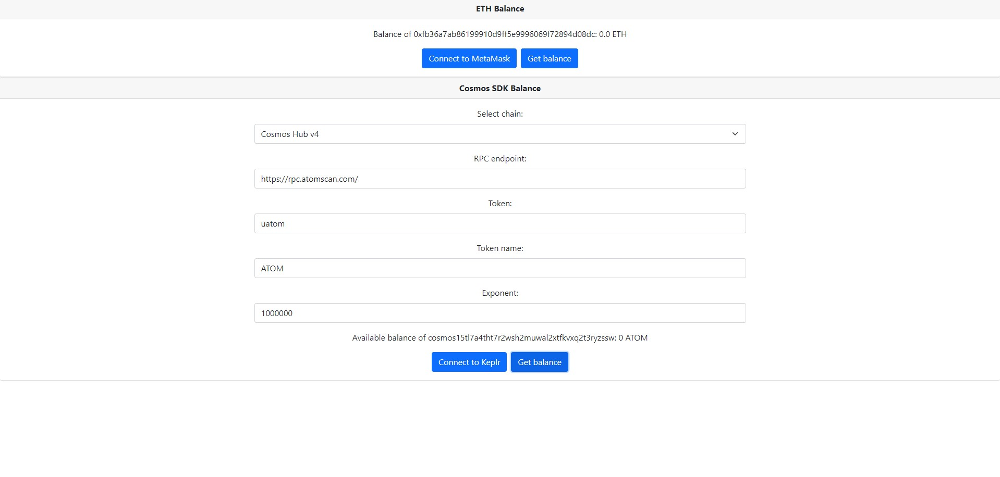
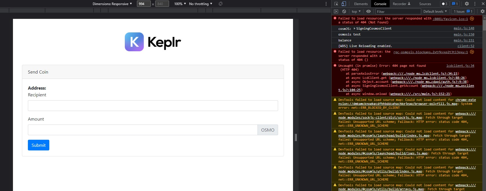

## Create React App
This project was bootstrapped with [Create React App](https://github.com/facebook/create-react-app).

This is a simple demo to show how to integrate with MetaMask and Keplr to read wallet balances.



### Local Development

Install dependencies.

```
npm install
```

Run React app.
```
npm start
```

For more details see comments on `src/App.js`. Development was done on Windows 10 Pro 21H1 (19043.1586) and node v16.14.2.

### Run tests

Command to run test.

```
npm test
```

### Run build

Command to run test.

```
npm run build
cd .\build\
npx serve
```

## MetaMask Integration
MetaMast integration went smooth since it's a more stable extension. I used ethers library in version 5.6.2 to display balance in readable format.

## Keplr Integration
Unfortunately "Keplr extension manages only one address/public key pair" but it's enough for our read balance purposes of the first wallet.

Keplr documentation mentions also launchpad vs stargate versioning but it seems that that is not updated.

https://blog.cosmos.network/launchpad-a-pre-stargate-stable-version-of-the-cosmos-sdk-e0c58d8c4e24

Let's hope that in future integration with that extension will be improved like MetaMask but for now, we need RPC/REST call to the Cosmos SDK node to query that:
- REST: https://node.atomscan.com
- RPC: https://rpc.atomscan.com/

I used @cosmjs/stargate and RPC because of its lightweight payloads and high performance.

### Keplr wallet API
https://docs.keplr.app/api/

### Keplr example
There is an example https://github.com/chainapsis/keplr-example/blob/master/src/main.js but it seems that is not working because of the versioning problem with @cosmjs/launchpad.



## Todo in future
- Use eventListeners to hook up wallet events and remove text inputs (if possible). I'm sure there is a way to display balance when you change chain in Keplr. Also is there an API gateway to all Cosmos SDK blockchains to improve UI/UX?
- Check 25 vulnerabilities in 1929 packages
- Add store via Redux 
- Add ESLint, check react live update
- Add more tests
- Add exception handling if provided data are wrong
- There was a problem with the crypto library in @cosmjs/crypto/build/pbkdf2.js 56:67-84, it turns out that I needed to downrange react-scripts to 4.0.3, investigate why is that